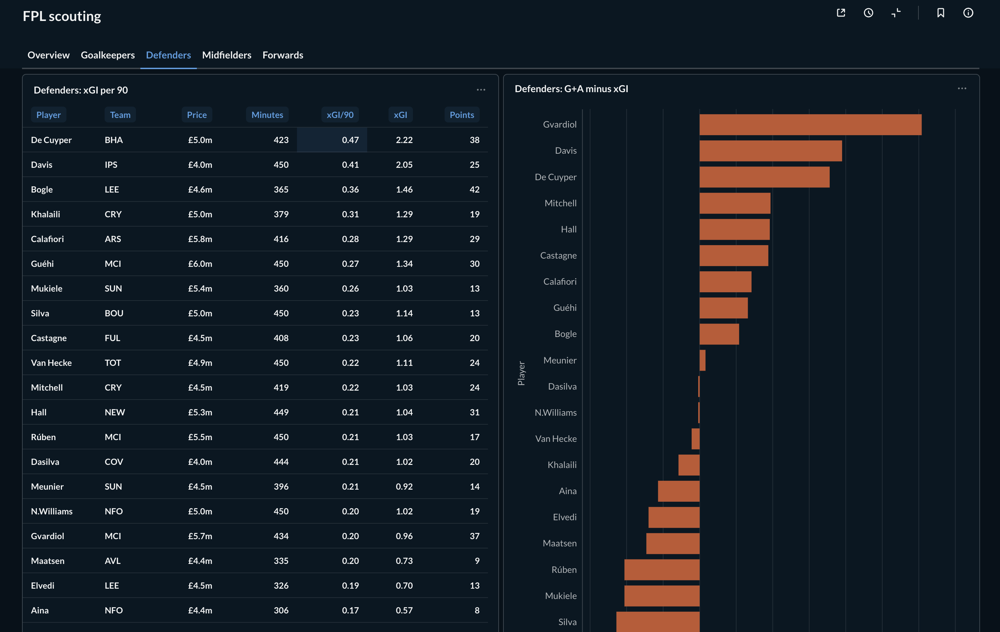
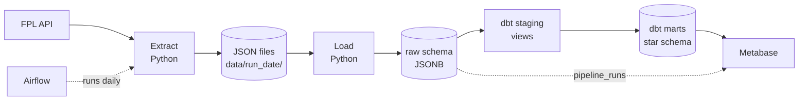
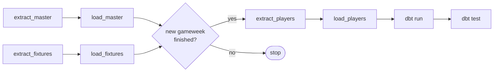
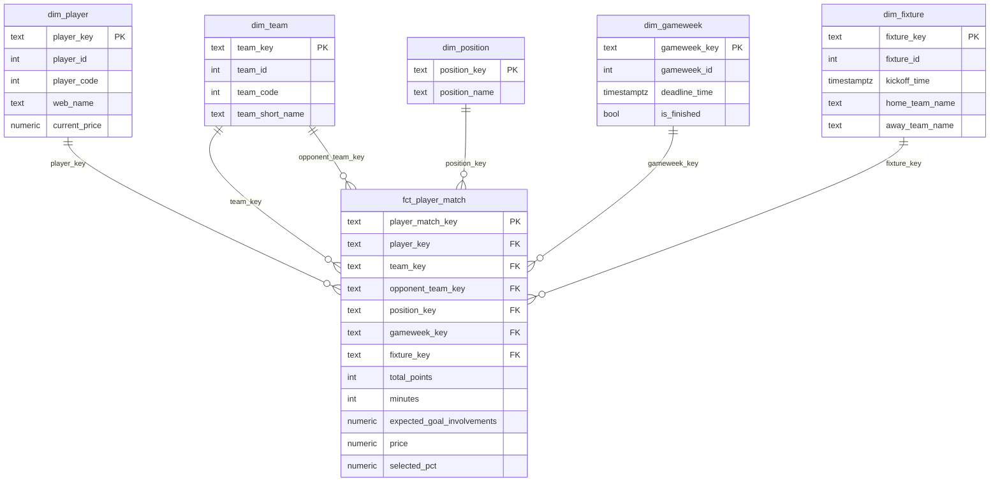

# FPL Data Pipeline
A daily ELT pipeline for Fantasy Premier League (FPL) data. Python extracts the FPL API, PostgreSQL stores the raw JSON, dbt builds a tested star schema, Airflow runs it every day, and Metabase shows the results.

**Stack:** Python, PostgreSQL, dbt Core, Apache Airflow, Metabase, Docker. 



## What it does

- Every day at 08:00 HKT, it saves the FPL master file (players, teams, gameweeks) and the fixtures as JSON, and loads them into Postgres as JSONB.
- After each gameweek, it also saves every player's match history, then rebuilds the dbt models and runs tests.
- dbt builds 5 dimensions and 1 fact table (one row per player per fixture), plus 4 analysis tables.
- A script builds two Metabase dashboards: **FPL scouting** (season to date) and **FPL form** (each player's last N games, with N as a filter, default 5).

## Pipeline



The Airflow DAG `fpl_daily`:



- Master and fixtures load every day, so the warehouse keeps a daily snapshot of prices and player status.
- The gate compares the newest finished gameweek in today's master file with the one at the last player load. Player histories only change after a gameweek, so on other days the player calls and dbt are skipped.

## Data model



- The fact table has one row per player per fixture, with every match stat, the price and the ownership percent. Every key is made from the season and the FPL id, because FPL reuses ids each season.
- The foreign keys live on the fact table (for example, the player's team at match time), so the dimensions never point at each other. This keeps a star schema.
- Analysis tables built from the fact table:

| Table | One row per | Used for |
| --- | --- | --- |
| `player_season_stats` | player and season | totals, per-90 rates, points per £m |
| `player_form` | player and match | rolling 5-match form |
| `player_scouting` | player and season | the season stats with name, team and position (dashboard FPL scouting) |
| `player_scouting_last_n` | player and window of last N games | the same stats over each player's last N games (dashboard FPL form) |

## Setup
This project requires Docker, [uv](https://docs.astral.sh/uv/) and git.
1. Clone the repo and create `.env` with random secrets:

   ```bash
   git clone https://github.com/yutsz1203/fpl-data-pipeline.git
   cd fpl-data-pipeline
   cp .env.example .env
   uv run python -c "import pathlib, re, secrets; p = pathlib.Path('.env'); p.write_text(re.sub('=change-me$', lambda m: '=' + secrets.token_hex(16), p.read_text(), flags=re.M))"
   ```

2. Build the Airflow image, then start the stack:

   ```bash
   mkdir -p airflow/logs data
   docker compose build airflow-init
   docker compose up -d --wait
   ```

3. Run the pipeline once:

   ```bash
   docker compose exec airflow-scheduler airflow dags unpause fpl_daily
   ```
    Follow it in the Airflow UI at http://localhost:8080 (user `admin`, password `AIRFLOW_ADMIN_PASSWORD` from `.env`), or wait until this shows `success`:

   ```bash
   docker compose exec airflow-scheduler airflow dags list-runs fpl_daily
   ```

4. Build the dashboards:

   ```bash
   uv run python metabase/provision.py
   ```

   Open http://localhost:3000 and log in with `METABASE_ADMIN_EMAIL` and `METABASE_ADMIN_PASSWORD` from `.env`.


## Day to day

- `docker compose stop` and `docker compose up -d` keep all data. Do not run `docker compose down -v`: it deletes the warehouse and the Metabase database.
- Never change `METABASE_ENCRYPTION_KEY` after the first start. Metabase can't read its own database without it.
- The Airflow image contains copies of `dbt/` and `scripts/`. After you change them, run `docker compose up -d --build`.
- You can rerun `metabase/provision.py` at any time. It updates the cards and dashboards in place and overwrites changes made in the Metabase UI.
- To run dbt from your machine: `cd dbt`, then `uv run dbt deps` once, then `uv run dbt build`. The warehouse is on `localhost:5433`.
- Notebooks: `uv run jupyter lab notebooks/`.

## Project layout
```
fpl-data-pipeline/
├── airflow/                  # Dockerfile and the DAG (dags/fpl_daily.py)
├── dbt/                      # dbt project with its own uv environment: staging, marts, tests
├── images/                   # README screenshot
├── metabase/                 # provision.py: the dashboards as code
├── notebooks/                # API exploration and the top-players analysis
├── scripts/                  # extract and load scripts, run log
└── sql/                      # schemas, raw tables and the read-only Metabase role
```

